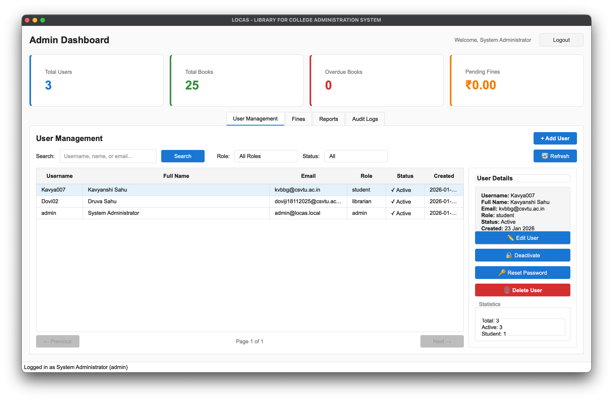
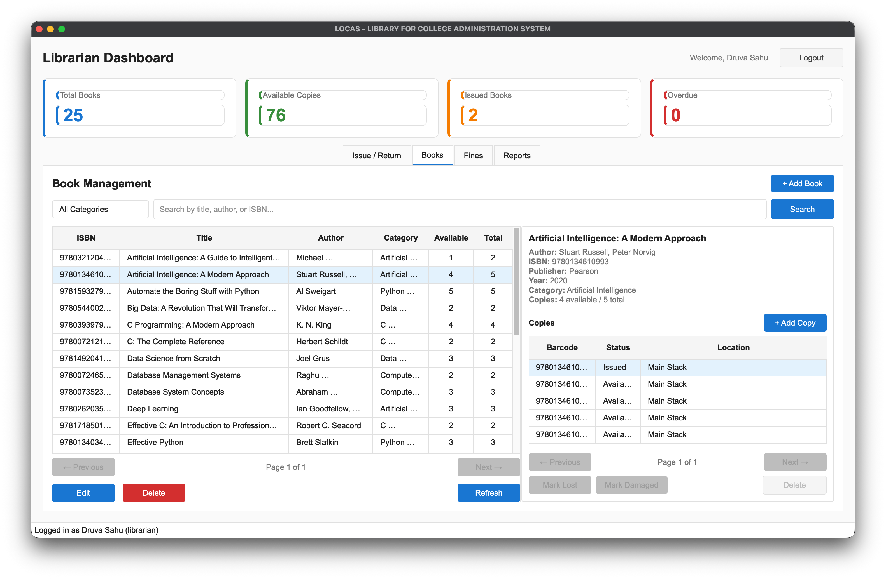
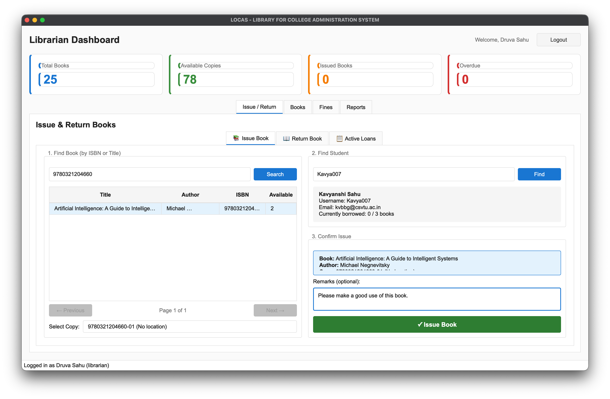
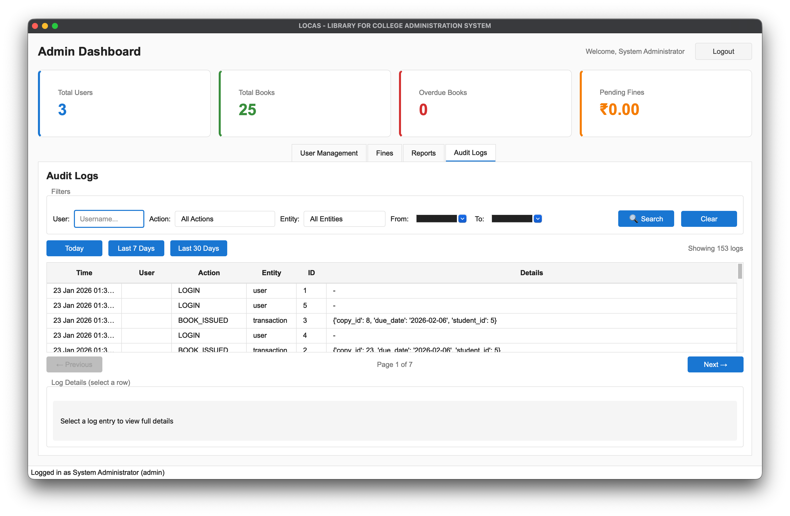

# LOCAS - Library for College Administration System

A Simple desktop library management system for college administration.


## Screenshots

| **Admin Dashboard** | **Book Management** |
|:---:|:---:|
|  |  |
| **Real-time Stats & User Management** | **Catalog CRUD & Search** |

| **Issue/Return** | **Fine Management** |
|:---:|:---:|
|  |  |
| **Circulation** | **Logs** |

## Features

- **Role-based Access Control (RBAC)**: Secure login with hashed passwords for Admin, Librarian, and Student roles.
- **Book Catalog Management**: 
    - Full CRUD operations for book metadata (Title, Author, ISBN, Category).
    - **Multiple Copies**: Track physical copies with unique barcodes for inventory control.
- **User Administration**:
    - **Admin Dashboard**: Real-time stats on total users, books, and pending fines.
    - **Lifecycle Management**: Create, Edit, Activate/Deactivate, and Delete users.
    - **Robust Deletion System**: 
        - Prevents accidental deletion of users with active loans/fines.
        - **Force Delete**: Admin override to clean up data (wipes history & reassigns records).
- **Circulation (Issue/Return)**:
    - Fast searching by ISBN or Student Username.
    - Automatic due date calculation and fine generation for overdue items.
    - Track "Lost" or "Damaged" books.
- **Financials**:
    - Pay or Waive fines.
    - Audit logs for all financial transactions.
- **Audit System**:
    - Detailed JSON-based logs for every sensitive action (LOGIN, USER_DELETED, BOOK_ISSUED).
    - Viewable exclusively by Admins.

## Application Architecture

The application is built using a clean **Service-Repository-Model** pattern:

- **GUI Layer (`src/locas/gui`)**: PyQt6 widgets and views. Handles signals (like live dashboard updates) and user input.
- **Service Layer (`src/locas/services`)**: Business logic (e.g., "Calculate fine", "Check if user can be deleted").
- **Repository Layer (`src/locas/repositories`)**: Direct database SQL operations.
- **Core (`src/locas/core`)**: Database connection (MySQL), Security (hashing), and Configuration.

This architecture ensures scalability and easy testing.

## Tech Stack

- **Python 3.12+**
- **PyQt6** - Desktop GUI framework
- **MySQL 8+** - Database
- **bcrypt** - Password hashing
- **UV** - Package manager

## Quick Start

### Prerequisites

1. **Python 3.12+**: Ensure strict compatibility.
2. **MySQL 8.0+**: Required for JSON field support.
3. **UV Package Manager**: [Install UV](https://github.com/astral-sh/uv) (`curl -LsSf https://astral.sh/uv/install.sh | sh`).

### Step-by-Step Installation (New User Setup)

1. **Clone the Repository**
   ```bash
   git clone <repository-url>
   cd LOCAS
   ```

2. **Environment Configuration**
   - Copy the example environment file:
     ```bash
     cp .env.example .env
     ```
   - Open `.env` and fill in your MySQL credentials:
     ```ini
     DB_HOST=localhost
     DB_PORT=3306
     DB_USER=root       # Or your specific user
     DB_PASSWORD=your_password
     DB_NAME=locas_db
     ```

3. **Install Dependencies**
   - We use `uv` for fast, reproducible builds:
     ```bash
     uv sync
     ```
   - *Troubleshooting*: If `uv` fails to find Python, run `uv python install 3.12`.

4. **Initialize Database**
   - Create the database and load the schema:
     ```bash
     # Create DB
     mysql -u root -p -e "CREATE DATABASE IF NOT EXISTS locas_db CHARACTER SET utf8mb4 COLLATE utf8mb4_unicode_ci;"

     # Import Schema
     mysql -u root -p locas_db < sql/schema.sql
     ```

### Database Setup

```bash
# Create the database
mysql -u root -p -e "CREATE DATABASE locas_db CHARACTER SET utf8mb4 COLLATE utf8mb4_unicode_ci;"

# Run the schema
mysql -u root -p locas_db < sql/schema.sql
```

### Running the Application

```bash
# Run with UV
uv run locas

# Or activate venv and run directly
source .venv/bin/activate  # On macOS/Linux
python -m locas
```

## User Guide

### 1. Admin Workflow
- **Login**: Use default credentials (`admin` / `Admin@123`).
- **Dashboard**: View live stats. Click "Refresh" or perform actions to see numbers update instantly.
- **Manage Users**:
    - Go to "User Management".
    - Click **+ Add User** to create Librarians or Students.
    - Select a user to **Force Delete** (if they have old history) or **Toggle Status**.
- **Audit Logs**: Review "Audit Logs" tab to see who did what (e.g., "USER_DELETED" actions).

### 2. Librarian Workflow
- **Login**: Use a Librarian account.
- **Issue Book**: 
    - Go to "Issue/Return".
    - Search for a Student and a Book Copy (by Barcode/ISBN).
    - Click "Issue Book".
- **Return Book**:
    - Select an active loan in the list.
    - Click "Return Book". If overdue, a fine is generated automatically.
- **Manage Fines**: View pending fines for students and mark them as Paid or Waived.

### 3. Student Workflow
- Students can login to view their own:
    - Currently issued books.
    - Due dates.
    - Pending fines.
    - Borrowing history.

## Default Credentials

| Username | Password | Role |
|----------|----------|------|
| admin | Admin@123 | Administrator |

> ⚠️ **Important**: Change the default admin password after first login!

## Project Structure

```
LOCAS/
├── src/locas/           # Main application package
│   ├── core/            # Core utilities
│   ├── models/          # Data models
│   ├── repositories/    # Data access layer
│   ├── services/        # Business logic
│   └── gui/             # PyQt6 GUI
├── sql/                 # Database scripts
├── tests/               # Test suite
└── docs/                # Documentation
```

## Development

```bash
# Install with dev dependencies
uv sync --all-extras

# Run tests
uv run pytest

# Run linter
uv run ruff check .

# Run type checker
uv run mypy src/

## License

Proprietary - College Use Only
